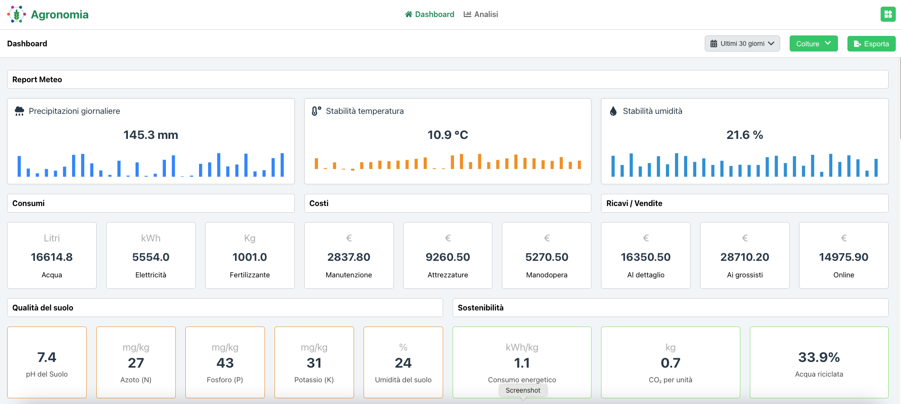
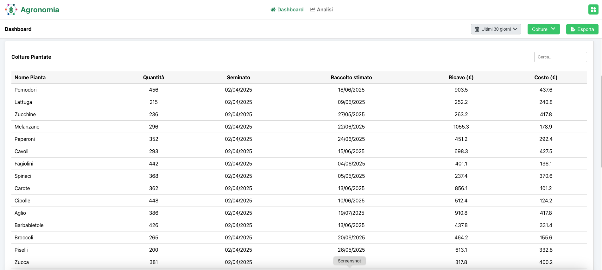
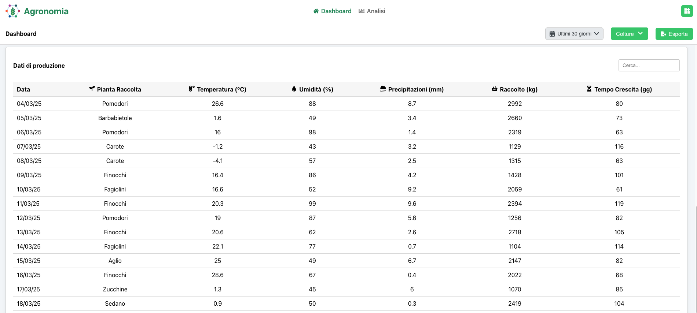
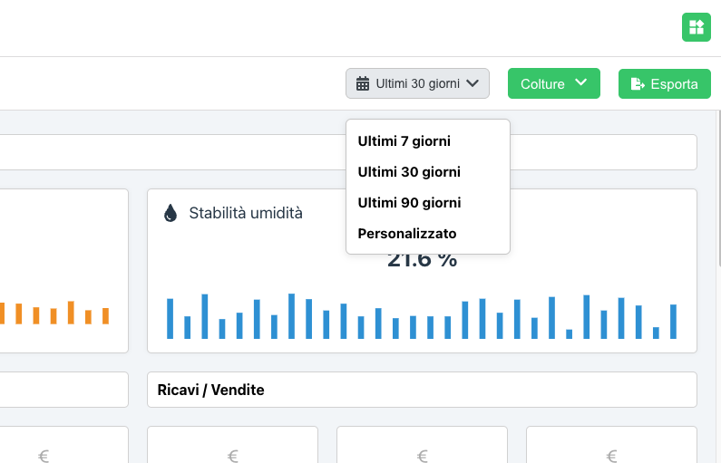
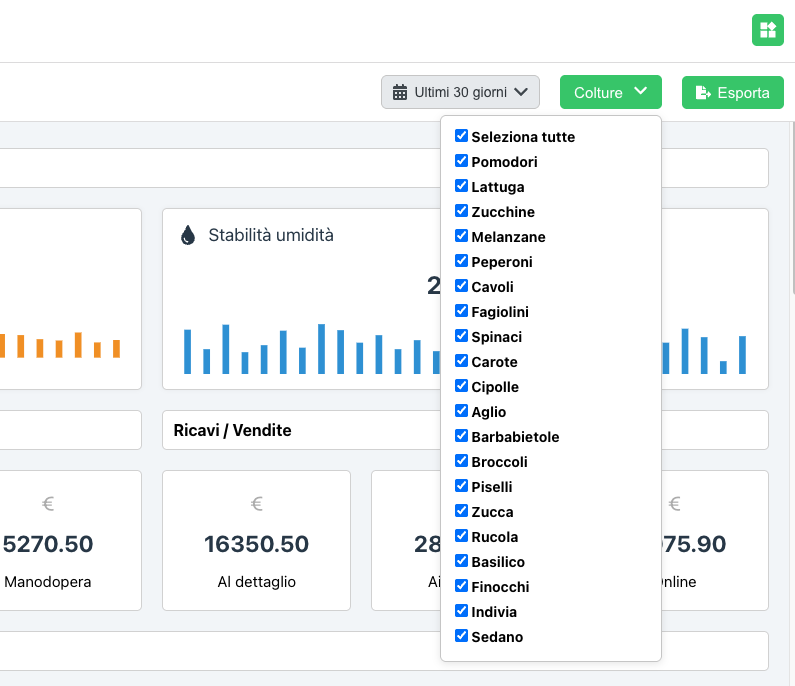
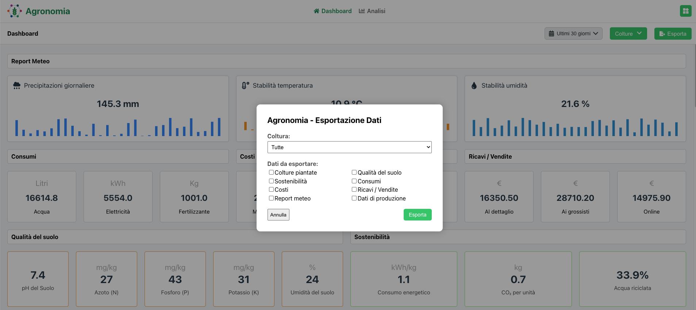
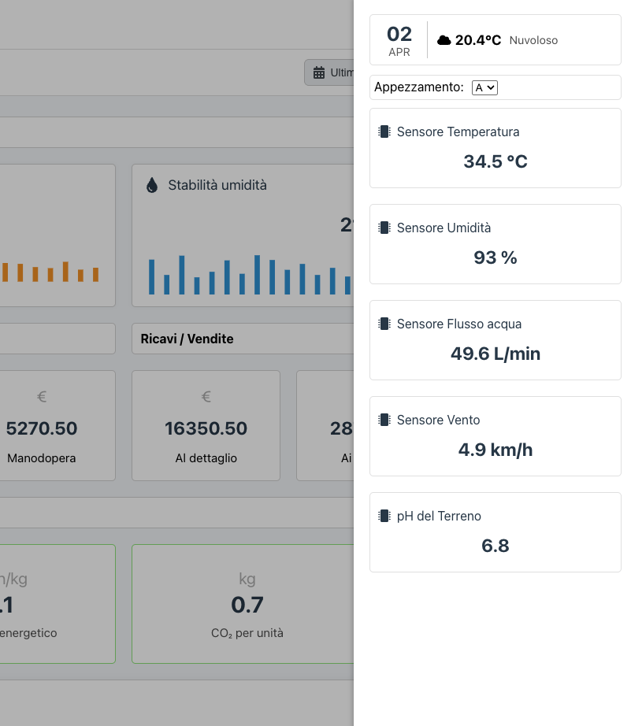
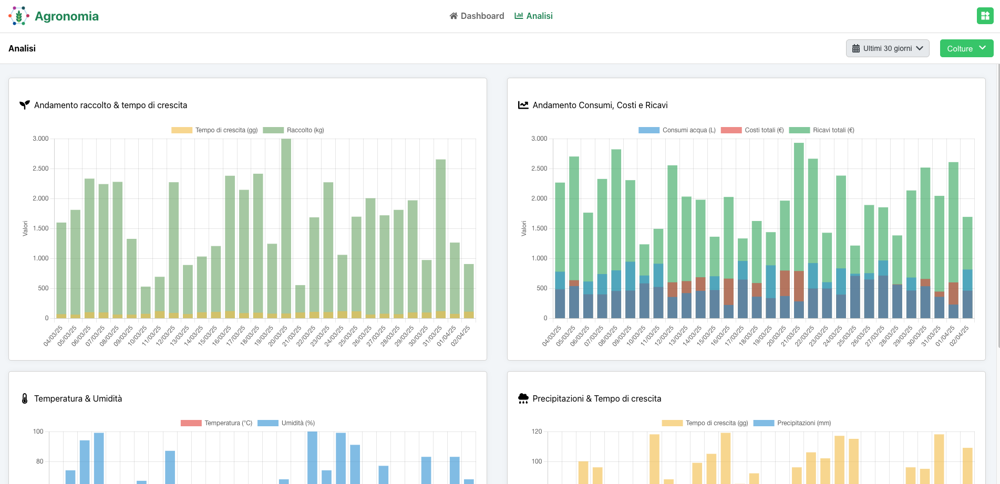

# Agronomia Dashboard

**Agronomia** è una dashboard web interattiva pensata per l’analisi e la visualizzazione delle performance agronomiche e ambientali di un’azienda del settore primario.  
Permette di monitorare **raccolti, colture, consumi, costi, ricavi e sostenibilità** tramite grafici e indicatori KPI dinamici su base storica simulata.

## Screenshot dell'applicazione

### Dashboard


### Dashboard | Datatable colture piantate


### Dashboard | Dati di produzione


### UI / UX | Menu periodo di visualizzazione


### UI / UX | Menu di selezione delle colture da visualizzare nelle metriche generali


### UI / UX | Modale per selezionare quali elementi si desidera esportare


### Widget sidebar per visualizzazione output sensori 


### Pagina Analisi


## Funzionalità principali

- Visualizzazione interattiva di dati agronomici (raccolto, crescita, meteo, costi, ecc.)
- Filtraggio temporale (ultimi 7/30/90 giorni o periodo personalizzato)
- Filtro per colture e appezzamenti
- Grafici multipli: prestazioni, ambiente, precipitazioni, fattori economici
- Tabelle dati con esportazione CSV
- KPI aggregati e sensori per ogni appezzamento
- Sidebar widget con meteo e sensori in tempo reale
- Responsive design per mobile e tablet

---

## Tecnologie usate

- **React 18+**
- **Chart.js** per grafici dinamici
- **JSZip** + **file-saver** per esportazione ZIP/CSV
- **React Icons** (Font Awesome)
- CSS Grid/Flexbox con media queries per il layout responsive

---

## Struttura del progetto

```
src/
├── components/               # Componenti riutilizzabili
│   ├── HeaderComponent.js
│   ├── WidgetSidebarComponent.js
│   ├── SensorKpiComponent.js
│   ├── PerformanceChartComponent.js
│   ├── EnvironmentalChartComponent.js
│   ├── EconomicChartComponent.js
│   └── ...
├── pages/
│   ├── DashboardPage.js
│   └── AnalisiPage.js
├── services/
│   └── simulationService.js  # Simulatore dei dati agronomici
├── utils/
│   ├── exportUtils.js        # Esportazione CSV/ZIP
│   └── dataUtils.js          # Aggregazioni settimanali
├── styles/
│   └── styles.css
└── App.js
```

---

## ▶Avvio locale

### 1. Clona il progetto

```bash
git clone https://github.com/zenoproduction/agronomia-dashboard.git
cd agronomia-dashboard
```

### 2. Installa le dipendenze

```bash
npm install
```

### 3. Avvia l'applicazione

```bash
npm start
```

L'app sarà disponibile su [http://localhost:3000](http://localhost:3000)

---

## Dipendenze principali

```json
"dependencies": {
  "chart.js": "^4.x",
  "file-saver": "^2.x",
  "jszip": "^3.x",
  "react": "^18.x",
  "react-chartjs-2": "^5.x",
  "react-dom": "^18.x",
  "react-icons": "^4.x",
  "react-router-dom": "^6.x"
}
```

---

## Responsive design

L’interfaccia è completamente responsive:

- Layout adattivo per grafici, tabelle e widget
- Navigazione semplice anche su dispositivi mobili
- Sidebar sensori visibile come pannello scorrevole

---

## Esportazione dati

Cliccando su **"Esporta"** è possibile esportare:

- Colture piantate
- Qualità del suolo
- Consumi, Costi, Ricavi
- Report meteo e produzione

Tutti i dati vengono salvati in un file ZIP contenente più CSV separati.

---

## Note

- I dati sono simulati e rigenerati ad ogni avvio.
- Ogni appezzamento ha dati sensoriali distinti.
- La dashboard si può estendere per supportare dati reali da API.

---

## Autore

Progetto sviluppato da Marco Venturelli.  
Contatti o info aggiuntive: info@marcoventurelli.com